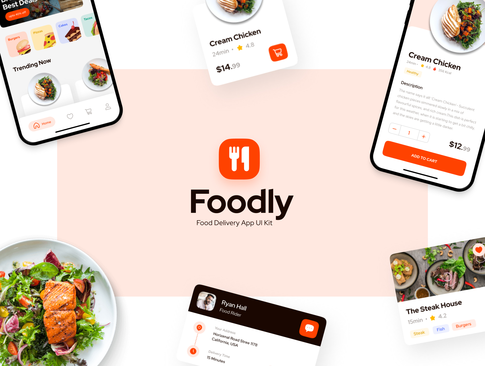

<!-- PROJECT LOGO -->
 

  

  <h3 align="center">Foodly</h3>

  

    Food delivery application
     
     
    <a href="https://github.com/Dewerro/Foodly/issues">Report Bug</a>
    ·
    <a href="https://github.com/Dewerro/Foodly/issues">Request Feature</a>
  

<!-- ABOUT THE PROJECT -->
## About The Project

This is a food delivery training application using VIP architecture, UIKit and Firebase.

### Built With

* UIKit
* Firebase

<!-- Design Source -->
## Design Source
Design was taken from here: https://workux17.gumroad.com/l/phanx

<!-- LICENSE -->
## License

Distributed under the MIT License. See `LICENSE.txt` for more information.
