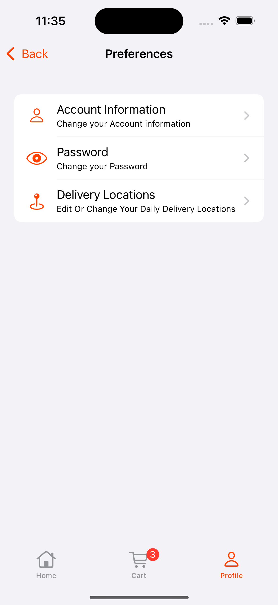

# Foodly 🍔🍕🍰🌮

**Foodly** is a modern iOS food delivery application built to provide a seamless and intuitive experience for users to browse, order, and track food deliveries from their favorite restaurants. The app is developed using **Swift** and **UIKit**, leveraging the **VIPER** architecture for a clean, scalable, and maintainable codebase. **Firebase** powers the backend for authentication, real-time database, and push notifications.

## Features

- **User Authentication**: Secure sign-up, login, and logout using Firebase Authentication.
- **Menu Browsing**: Explore the food menu divided into four categories: burgers, pizza, cakes and tacos.
- **Restaurant Browsing**: Explore a curated list of nearby restaurants.
- **Order Placement**: Add items to the cart, customize orders, and checkout seamlessly.
- **User Profile**: Change profile information, such as setting a profile picture.

## Tech Stack

- **Language**: Swift
- **UI Framework**: UIKit
- **Architecture**: VIPER
- **Backend**: Firebase (Authentication, Firestore)
- **Dependency Management**: Swift Package Manager (SPM)
- **Minimum iOS Version**: iOS 15.0

## Installation

### Prerequisites

- Xcode 16.0 or later
- iOS 15.0 or later
- Firebase account for backend configuration

### Steps

1. **Clone the Repository**:
   ```bash
   git clone https://github.com/Demerro/Foodly.git
   cd Foodly
   ```
2. **Install Dependencies**
   - Open `Foodly.xcodeproj` in Xcode.
   - Dependencies are managed via Swift Package Manager and will be resolved automatically.
3. **Configure Firebase**
   - Create a Firebase project at [Firebase Console](https://console.firebase.google.com/).
   - Add an iOS app to your Firebase project and download the `GoogleService-Info.plist` file.
   - Place `GoogleService-Info.plist` in the root of the Xcode project.
   - Enable Firebase Authentication and Firestore in the Firebase Console.
4. **Build and Run**
   - Select your target device or simulator in Xcode.
   - Press `Cmd + B` to build and `Cmd + R` to run the app.
  
## Project Structure

Foodly follows the **VIPER** architecture, ensuring modularity and separation of concerns:
  - **View**: UIKit view controllers and UI components.
  - **Interactor**: Business logic and data handling.
  - **Presenter**: Mediates between View and Interactor.
  - **Entity**: Data models.
  - **Router**: Navigation logic.
  - **Worker**: Encapsulates specific tasks such as network requests (e.g., fetching menus from Firebase) or data processing (e.g., fetch and process nearby restaurants from MapKit). Workers are used by Interactors to keep business logic modular and reusable.

## Screenshots

Below are screenshots of Foodly, grouped by user flow:

### Onboarding Flow
| First | Second | Third |
| ----- | ------ | ------ |
|  |  |  |

### Authentication Flow
| Login | Sign Up | Forget Password |
| ----- | ------- | --------------- |
|  |  |  |

### Home Flow
| Home | Food Category | Food Details | Food Search | Restaurants Search |
| ---- | ------------- | ------------ | ----------- | ------------------ |
|  |  |  |  |  |

### Cart Flow
| Cart | Make Order |
| ---- | ---------- | 
|  |  |

### Profile Flow
| Profile | Preferences |
| ------- | ----------- | 
|  |  |

## Contributing

Contributions are welcome! Please follow these steps:

1. Fork the repository.
2. Create a feature branch (`git checkout -b feature/your-feature`).
3. Commit your changes (`git commit -m "Add your feature"`).
4. Push to the branch (`git push origin feature/your-feature`).
5. Open a Pull Request.

## License

This project is licensed under the MIT License. See the `LICENSE.txt` for details.

## Contant

For questions or feedback, open an issue on GitHub.

## Design Source

The design was taken from https://workux17.gumroad.com/l/phanx
